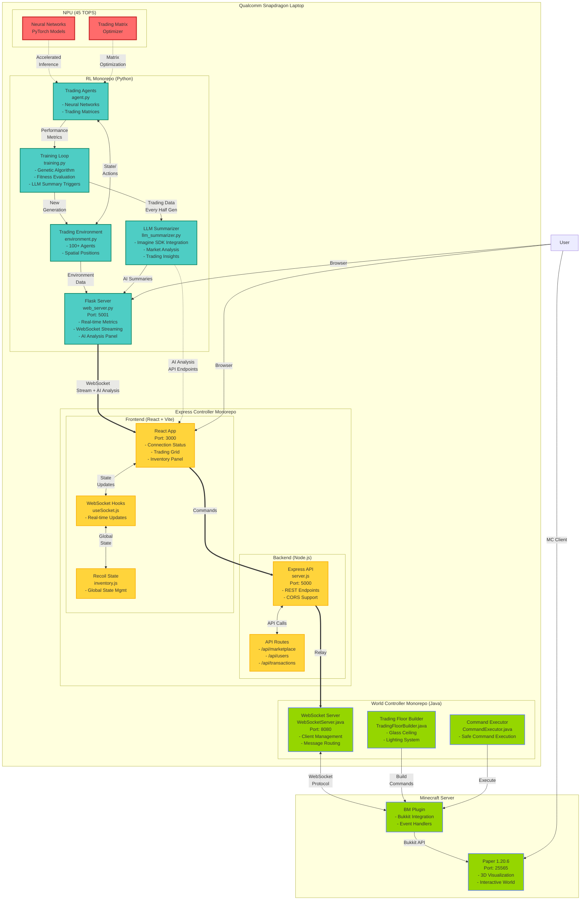

# BlockMarket: Multi-Agent Reinforcement Learning Trading Arena

**Track 3: RL Agent Arena Submission**


An innovative reinforcement learning platform that trains intelligent trading agents in a spatially-aware bartering economy, optimized for Qualcomm Snapdragon X Elite NPU acceleration and beautifully visualized through Minecraft integration.

BlockMarket is a cutting-edge reinforcement learning environment where neural network agents learn how to maximize the amount of trades in a simulated trading floor (Kudos to the early 2000s floor traders in places like the New York Stock Exhcange (NYSE)). Our platform leverages the power of Qualcomm Snapdragon's dedicated NPU and powerful CPU to run complex neural networks locally, ensuring real-time decision-making with complete privacy preservation.

Under each folder, there is a more in-depth README for each component.

## Team Members

- **Ibraheem Amin** - ia8920@princeton.edu (<ibraheem.amin2@gmail.com>) (Team Lead) ([DIodide](https://github.com/DIodide))
- **Richard Wang** - rw8166@princeton.edu
- **Cole Ramer** - cr0058@princeton.edu
- **Khang Tran** - kt3119@princeton.edu
- **John Wu** - jw7893@princeton.edu

## System Architecture Overview



### How It Works

1. **Three Monorepos Architecture**:

   **RL Monorepo (Python)**:

   - `environment.py`: Manages 100+ trading agents with spatial positions
   - `agent.py`: Neural networks leveraging Snapdragon NPU for 45 TOPS inference
   - `training.py`: Genetic algorithm implementation for population evolution with LLM triggers
   - `web_server.py`: Flask server streaming real-time metrics and AI analysis via WebSocket
   - `llm_summarizer.py`: Imagine SDK integration for intelligent market analysis and insights

   **Express Controller Monorepo (JavaScript)**:

   - Backend: Express.js API server with REST endpoints for marketplace data
   - Frontend: React + Vite app with Recoil state management
   - WebSocket hooks for real-time updates from Flask server
   - Responsive UI with trading grid and inventory visualization

   **World Controller Monorepo (Java)**:

   - WebSocket server accepting commands from Express backend
   - Trading floor builder creating 3D structures in Minecraft
   - Safe command execution with configurable security

2. **Socket Tunneling & AI Analysis Flow**:

   ```
   RL Environment → Flask WebSocket → React Frontend
                         ↓              ↑
   LLM Summarizer → AI Analysis ────────┘
                         ↓
   Minecraft Server ← Plugin ← WebSocket ← Express API
   ```

   - Flask streams environment updates and AI analysis to React dashboard
   - LLM generates intelligent summaries every half generation (50 timesteps)
   - React displays real-time trading insights powered by Imagine SDK
   - React sends commands through Express API
   - Express relays commands to World Controller WebSocket
   - Plugin executes commands in Minecraft world

3. **NPU Acceleration**:

   - PyTorch models run on Snapdragon NPU for neural network inference
   - Trading matrix optimization leverages 45 TOPS of AI performance
   - Real-time agent decision-making with minimal latency
   - Energy-efficient processing compared to CPU-only execution

4. **Integration Points**:
   - **Port 5001**: Flask visualization dashboard
   - **Port 5000**: Express API server
   - **Port 3000**: React development server
   - **Port 8080**: WebSocket server for Minecraft integration
   - **Port 25565**: Minecraft server (Paper 1.20.6)

### Key Innovation Points:

- **NPU-Optimized RL Training**: Neural networks are specifically optimized to leverage Snapdragon X Elite's NPU, achieving up to 45 TOPS of AI performance for real-time agent decision-making
- **AI-Powered Market Analysis**: Real-time LLM summaries using Imagine SDK (Llama-3.1-8B) provide intelligent insights on trading patterns, agent performance, and market dynamics every half generation
- **Spatial Trading Dynamics**: Agents exist in a 2D world where distance affects trading probability, creating realistic market dynamics
- **Minecraft Visualization**: Real-world trading scenarios are brought to life through interactive Minecraft environments, making complex AI behaviors visually comprehensible
- **Genetic Evolution**: Population-based training with genetic algorithms ensures continuous improvement of trading strategies
- **Privacy-First Design**: All AI computations run locally on the Snapdragon-powered device, ensuring complete data privacy

## Overview of RL Pipeline

### **Summary**

This is a **multi-agent reinforcement learning system** that simulates a trading economy where AI agents learn to trade resources optimally. It combines:
- **Genetic Algorithm**: Population-based evolution
- **Neural Networks**: Individual agent intelligence  
- **Strategic Value Function**: Multi-hop trading optimization
- **Spatial Dynamics**: Distance-based trade probability

---

### **RL Setup**

#### **1. Environment Layer** (`environment.py`)
**The World Controller** - Manages the entire trading ecosystem:

```
┌─────────────────────────────────────────┐
│           TradingEnvironment            │
├─────────────────────────────────────────┤
│ • 50 agents in 100x100 2D world        │
│ • 10 items: wood, stone, iron, gold,   │
│   food, water, coal, oil, copper,      │
│   silver                                │
│ • Market data aggregation              │
│ • Trade conflict resolution            │
│ • Genetic algorithm selection          │
└─────────────────────────────────────────┘
```

**Key Responsibilities:**
- **Agent Initialization**: Creates 50 agents with random positions, inventories, and desired items
- **Market Data Collection**: Aggregates all trading matrices into public market data
- **Trade Processing**: Validates, resolves conflicts, and executes trades
- **Generation Management**: Eliminates bottom 50% of agents, creates offspring from survivors

#### **2. Agent Layer** (`agent.py`)
**Individual Traders** - Each agent is an autonomous trading entity:

```
┌─────────────────────────────────────────┐
│             TradingAgent                │
├─────────────────────────────────────────┤
│ • Inventory: {item: quantity}           │
│ • Desired item: target to maximize     │
│ • Trading matrix: 10x10 exchange rates │
│ • Neural network: Policy predictor     │
│ • Strategic value function             │
└─────────────────────────────────────────┘
```

**Agent Capabilities:**
- **Matrix Updates**: Neural network predicts optimal trading rates
- **Trade Selection**: Chooses best trading partners and items
- **Strategic Planning**: Evaluates multi-hop trading paths
- **Learning**: Updates policy based on rewards

#### **3. Neural Network Layer** (`network.py`)
**Agent Brain** - Predicts optimal trading strategies:

```
┌─────────────────────────────────────────┐
│           TradingNetwork                │
├─────────────────────────────────────────┤
│ Input: [inventory + desired + market]   │
│ Hidden: 128-dim fully connected layers │
│ Output: 10x10 trading matrix           │
│ Constraint: Diagonal = 0 (no identity) │
└─────────────────────────────────────────┘
```

---

### **Core Processes**

#### **Timestep Flow** (Repeated 100 times per generation)

```
1. Matrix Update Phase
   ├─ Each agent updates trading matrix via neural network
   └─ Environment collects all matrices → public market data

2. Trade Request Phase  
   ├─ Each agent analyzes market + own state
   ├─ Selects optimal trade: (target_agent, give_item, want_item, amount)
   └─ Environment collects all requests

3. Trade Resolution Phase
   ├─ Validate requests (sufficient inventory)
   ├─ Resolve conflicts (distance-based probability)
   └─ Execute successful trades

4. Learning Phase
   ├─ Calculate rewards (inventory + strategic value)
   └─ Update neural network policies
```

#### **Generation Flow** (Up to 100 generations)

```
1. Fitness Evaluation
   ├─ Calculate each agent's performance
   └─ Rank agents by fitness score

2. Selection
   ├─ Keep top 50% of agents (25 survivors)
   └─ Eliminate bottom 50%

3. Reproduction  
   ├─ Create 25 offspring from survivors
   ├─ Apply mutation (10% probability)
   └─ Reset inventories for new generation

4. Convergence Check
   ├─ Early stopping if no improvement for 20 generations
   └─ Continue or terminate based on progress
```

---

### **Intelligence Systems**

#### **Strategic Value Function** - The Key Innovation

Instead of simple quantity maximization, agents use **multi-hop strategic planning**:

```python
# Example: Agent wants gold but has wood
# Direct trade: wood → gold (rate: 0.1) = 0.1 gold per wood
# Strategic path: wood → iron → gold  
#   wood → iron (rate: 0.5) = 0.5 iron per wood
#   iron → gold (rate: 0.3) = 0.15 gold per iron  
#   Total: 0.5 × 0.15 = 0.075 gold per wood

# Agent chooses direct trade (0.1 > 0.075)
```

**Strategic Features:**
- **Path Finding**: Breadth-first search with dynamic programming
- **Hop Penalty**: Each intermediate trade reduces efficiency (0.9^hops)
- **Market Awareness**: Uses real-time trading matrices from all agents
- **Opportunity Cost**: Balances immediate vs. strategic gains

---

### **Learning & Evolution**

#### **Individual Learning** (Neural Network)
- **Input**: Current inventory + desired item + market conditions
- **Processing**: 128-dimensional hidden layers
- **Output**: 10×10 trading matrix (100 exchange rates)
- **Training**: Gradient descent on reward signal

#### **Population Learning** (Genetic Algorithm)
- **Selection Pressure**: Only top 50% survive each generation
- **Mutation**: Random network weight perturbations (10% chance)
- **Diversity**: Offspring inherit from different high-performing parents
- **Convergence**: Early stopping prevents overfitting

---

### **Trade Mechanics**

#### **Trade Request Format**: `(agent_id, target_id, give_item, want_item, amount)`

```python
# Example trade request
requester = "agent_5"
target = "agent_23" 
give_item = "wood"      # What I'm offering
want_item = "iron"      # What I want
amount = 5              # How much iron I want

# Validation checks:
# 1. Does agent_5 have enough wood?
# 2. Will agent_23 accept this rate?
# 3. Is the trade distance feasible?
# 4. Are the items different? (no identity trades)
```

#### **Conflict Resolution**
When multiple agents want to trade with the same target:
- **Distance Priority**: Closer agents have higher probability
- **Probabilistic Selection**: `P(success) = exp(-distance/scale)`
- **Fair Competition**: No agent gets guaranteed trades

---

### **Emergent Behaviors**

The system exhibits sophisticated emergent properties:

#### **Market Dynamics**
- **Price Discovery**: Exchange rates converge to supply/demand equilibrium
- **Specialization**: Agents develop expertise in specific resource chains
- **Arbitrage**: Agents exploit price differences between markets

#### **Strategic Evolution**
- **Coalition Formation**: Indirect cooperation through beneficial trading
- **Competitive Adaptation**: Agents counter each other's strategies
- **Innovation**: Novel trading patterns emerge through mutation

#### **Economic Phenomena**
- **Resource Flows**: Efficient allocation of scarce resources
- **Market Cycles**: Boom and bust patterns in different commodities
- **Strategic Depth**: Multi-level planning and counter-planning

## System Architecture


```
┌─────────────────────────────────────────────────────────────────┐
│              Qualcomm Snapdragon Laptop                         │
│                                                                 │
│  ┌─────────────────────────────────────────────────────────┐    │
│  │         NPU (45 TOPS) - PyTorch Acceleration            │    │
│  │  • Neural Network Inference for Trading Agents          │    │
│  │  • Trading Matrix Optimization                          │    │
│  │  • Real-time Decision Making                            │    │
│  └─────────────────────────────────────────────────────────┘    │
│                                                                 │
│  ┌─────────────────────────────────────────────────────────┐    │
│  │              RL Monorepo (Python)                       │    │
│  │  • Trading Environment (100+ agents)     :5001          │    │
│  │  • Flask WebSocket Server ─────────────────┐            │    │
│  │  • Genetic Algorithm Evolution             │            │    │
│  │  • LLM Summarizer (Imagine SDK) ───────────┘            │    │
│  └────────────────────────────────────────────────────────┘    │
│                                                            │    │
│  ┌─────────────────────────────────────────────────────────┐    │
│  │        Express Controller Monorepo (JS)                 │    │
│  │  ┌───────────────────────────┐  ┌────────────────────┐  │    │
│  │  │   React Frontend :3000    │←─┤ Express API :5000  │  │    │
│  │  │   • Trading Grid UI       │  │ • REST Endpoints   │  │    │
│  │  │   • Real-time Updates     │  │ • Command Relay    │─┼───┐
│  │  │   • Inventory Panel       │  └────────────────────┘ │    │
│  │  └───────────────────────────┘                         │    │
│  └─────────────────────────────────────────────────────────┘   │
│                                                                │
│  ┌─────────────────────────────────────────────────────────┐   │
│  │      World Controller Monorepo (Java)                   │   │
│  │  • WebSocket Server :8080 ←─────────────────────────────┘   │
│  │  • Trading Floor Builder                                │   │
│  │  • Bukkit Plugin Integration                            │   │
│  └───────────────┬─────────────────────────────────────────┘   │
└─────────────────────┼───────────────────────────────────────────┘
                     │
         ┌───────────▼────────────┐
         │  Minecraft Server      │
         │  Paper 1.20.6 :25565   │
         │  • 3D Trading Floors   │
         │  • Visual Simulation   │
         └────────────────────────┘

Socket Flow: RL → Flask → React → Express → WebSocket → Minecraft
AI Analysis: LLM Summarizer → Flask Dashboard (Every Half Generation)
```

## Setup Instructions

### Prerequisites

- **Hardware**: Qualcomm Snapdragon X Elite powered laptop
- **Operating System**: Windows 11 ARM64 or Linux ARM64
- **Software Requirements**:
  - Python 3.9+ (ARM64 optimized)
  - Node.js 18+ (ARM64 build)
  - Java 17+ (ARM64 JDK)
  - Minecraft Server (Paper/Spigot 1.20+) (can run locally)

### 1. Clone the Repository

```bash
git clone https://github.com/yourusername/blockmarket.git
cd blockmarket
```

### 2. Set Up Python Environment (RL Components)

```bash
cd rl/

# Create ARM64-optimized virtual environment
python -m venv venv_arm64
source venv_arm64/bin/activate  # On Windows: venv_arm64\Scripts\activate

# Install NPU-optimized dependencies
pip install -r requirements.txt
pip install qai-hub  # Qualcomm AI Hub for NPU optimization

# Configure NPU backend
python configure_npu.py
```

### 3. Build BlockMarket Controller Plugin

```bash
cd ../bm-world-controller/

# Ensure ARM64 Java is being used
java -version  # Should show ARM64/aarch64

# Build the plugin
mvn clean package

# Copy to Minecraft plugins folder
cp target/bm-world-controller-0.1-SNAPSHOT.jar /path/to/minecraft/plugins/
```

Do follow a tutorial for locally hosting a minecraft server setup.
The specific configuration we used is Paper 1.20.6, you can follow a guide
to set up a minecraft server here. https://minecraft.fandom.com/wiki/Tutorials/Setting_up_a_server#Windows_instructions

Simply run a startup script off of that link for Windows. Then update
the path and server url in the express service (we would set a .env if we had some more time.)

Our thing is a bit three pronged so its a little more setup, but all of it
can theoretically run locally. Minecraft Servers are very single threaded CPU intensive.

### 5. Set Up Express Controller (Backend)

```bash
cd ../bm-express-controller/master-server/

# Install Node dependencies (ARM64 native modules)
npm install

# Configure environment
cp .env.example .env
# Edit .env to set appropriate values
```

### 6. Set Up Frontend Dashboard

```bash
cd ../frontend/

# Install dependencies
npm install

# Build for production
npm run build
```

### 7. Configure Minecraft Server

Edit `plugins/bm-world-controller/config.yml`:

```yaml
websocket:
  enabled: true
  port: 8080
  bind-address: "127.0.0.1" # Local only for security
```

## Running the Application

### 1. Start the Minecraft Server

```bash
cd /path/to/minecraft-server/
java -Xmx4G -jar paper-1.20.jar nogui
```

### 2. Launch the RL Training Environment

```bash
cd blockmarket/rl/

# Activate NPU-optimized environment
source venv_arm64/bin/activate

# Start training with NPU acceleration
python training.py --use-npu --device snapdragon
```

### 3. Start the Express Backend

```bash
cd blockmarket/bm-express-controller/master-server/
npm start
```

### 4. Launch the Visualization Dashboard

```bash
cd blockmarket/rl/
python web_server.py --port 5001
```

### 5. Access the Application

- **Web Dashboard**: http://localhost:5001
- **Minecraft Server**: Connect to `localhost:25565`
- **API Endpoints**: http://localhost:5000/api

## Usage Instructions

### Training RL Agents

1. **Configure Training Parameters**:

   ```bash
   cd rl/
   # Edit config.yaml to adjust hyperparameters
   ```

2. **Monitor Training Progress**:

   - Open web dashboard at http://localhost:5001
   - View real-time agent positions, fitness distributions, and trade networks
   - Track generation history and performance metrics

3. **Interact via Minecraft**:
   - Join the Minecraft server
   - Use `/createfloor <size>` to create trading arenas
   - Watch agents trade in real-time within the Minecraft world

### WebSocket Commands

Connect to the WebSocket server to control the environment:

```javascript
// Example: Create a trading floor
{
  "type": "create_trading_floor",
  "size": 20,
  "world": "world"
}
```

## NPU Optimization Details

Our implementation leverages Snapdragon X Elite's NPU for:

1. **Neural Network Inference**: Agent decision-making runs at 45 TOPS

Some more optimizations exist that are yet to be used.

### ONNX Model Conversion for NPU Acceleration

This document explains how to convert BlockMarket trading agent models from PyTorch (.pth) format to ONNX format for NPU acceleration on Qualcomm Snapdragon X Elite devices.

#### Overview

The ONNX conversion system enables trading agent neural networks to leverage the 45 TOPS of AI performance available on Snapdragon X Elite NPUs, providing significant acceleration for real-time inference during trading decisions.

#### Features

- **Automatic Model Discovery**: Finds all .pth files in the models directory
- **Batch Conversion**: Convert all models at once or individual models
- **Model Validation**: Verifies ONNX models produce identical outputs to PyTorch versions
- **NPU Optimization Metadata**: Includes optimization hints for Qualcomm NPU deployment
- **Usage Examples**: Generates ready-to-use inference code

#### Quick Start

##### 1. Install Dependencies

```bash
cd blockmarket/rl
pip install -r requirements.txt
```

##### 2. Convert All Models

```bash
python convert_models.py
```

##### 3. Convert Specific Model

```bash
python convert_models.py --model-path models/trading_agents/agent_final.pth
```

##### 4. Generate NPU Usage Example

```bash
python convert_models.py --create-example
```

#### Detailed Usage

##### Command Line Options

```bash
python convert_models.py [OPTIONS]

Options:
  --model-path PATH     Convert specific .pth model file
  --pattern PATTERN     Glob pattern for finding .pth files (default: *.pth)  
  --config PATH         Path to configuration file (default: config.yaml)
  --validate-only       Only validate existing ONNX models, do not convert
  --create-example      Create NPU inference example code
  --help               Show help message
```

##### Programmatic Usage

```python
from onnx_conversion import ONNXConverter

# Create converter
converter = ONNXConverter()

# Convert all models
results = converter.convert_all_models()

# Convert specific model
success = converter.convert_single_model('path/to/model.pth')

# Create NPU inference example
converter.save_inference_example()
```

#### Output Structure

After conversion, the following files are created in `models/trading_agents/onnx/`:

```
models/trading_agents/onnx/
├── agent_final.onnx                    # ONNX model
├── agent_final_metadata.json          # Model metadata and NPU hints
├── agent_gen50_rank1.onnx             # Another converted model
├── agent_gen50_rank1_metadata.json    # Corresponding metadata
└── npu_inference_example.py           # Usage example code
```

#### Metadata Format

Each ONNX model includes a metadata JSON file with the following information:

```json
{
  "model_info": {
    "onnx_path": "agent_final.onnx",
    "model_type": "TradingNetwork", 
    "input_dim": 131,
    "output_dim": 25,
    "items_list": ["diamond", "gold", "apple", "emerald", "redstone"],
    "num_items": 5,
    "validation_passed": true
  },
  "agent_info": {
    "agent_id": "agent_0",
    "desired_item": "diamond",
    "training_history": 1250
  },
  "npu_optimization": {
    "target_device": "Qualcomm Snapdragon X Elite",
    "expected_tops": 45,
    "optimization_hints": [
      "Use QNN backend for inference",
      "Enable NPU execution provider", 
      "Consider FP16 quantization for better performance",
      "Batch size = 1 recommended for real-time inference"
    ]
  },
  "conversion_info": {
    "opset_version": 11,
    "torch_version": "2.0.1",
    "onnx_version": "1.14.0"
  }
}
```

#### NPU Inference Example

The converter automatically generates an example showing how to use the ONNX models with NPU acceleration:

```python
import onnxruntime as ort
import numpy as np
import json

# Configure ONNX Runtime for NPU acceleration
def create_npu_session(onnx_path: str):
    providers = [
        ('QNNExecutionProvider', {
            'backend_path': 'QnnHtp.dll',
            'profiling_level': 'basic',
            'rpc_control_latency': 1000,
            'vtcm_mb': 8,
            'htp_performance_mode': 'burst'
        }),
        'CPUExecutionProvider'  # Fallback
    ]
    
    session_options = ort.SessionOptions()
    session_options.graph_optimization_level = ort.GraphOptimizationLevel.ORT_ENABLE_ALL
    
    return ort.InferenceSession(onnx_path, sess_options=session_options, providers=providers)

# Run inference
session = create_npu_session("models/trading_agents/onnx/agent_final.onnx")
outputs = session.run(None, {'state_vector': input_data})
```

#### Integration with Training System

##### Automatic Conversion After Training

You can integrate ONNX conversion into the training pipeline by modifying the model saving process:

```python
from onnx_conversion import ONNXConverter

# In training.py or after training completes
def save_and_convert_models(env, model_save_path, generation):
    # Save PyTorch models (existing functionality)
    save_generation_models(env, model_save_path, generation)
    
    # Convert to ONNX for NPU deployment
    converter = ONNXConverter()
    converter.convert_all_models()
```

##### Real-time NPU Inference

Replace PyTorch inference in the `TradingAgent` class with ONNX NPU inference:

```python
class NPUTradingAgent(TradingAgent):
    def __init__(self, *args, **kwargs):
        super().__init__(*args, **kwargs)
        self.onnx_session = None
        
    def load_onnx_model(self, onnx_path: str):
        """Load ONNX model for NPU inference."""
        self.onnx_session = create_npu_session(onnx_path)
    
    def update_trading_matrix(self, market_data=None):
        """NPU-accelerated trading matrix update."""
        if self.onnx_session:
            state = self.get_state_vector(market_data)
            outputs = self.onnx_session.run(None, {'state_vector': state.numpy()})
            matrix_update = outputs[0].reshape(self.num_items, self.num_items)
            # Apply update with learning rate
            learning_rate = self.config['learning']['matrix_update_rate']
            self.trading_matrix = (1 - learning_rate) * self.trading_matrix + learning_rate * matrix_update
        else:
            # Fallback to PyTorch
            super().update_trading_matrix(market_data)
```

#### Performance Expectations

On Qualcomm Snapdragon X Elite with NPU acceleration:

- **Inference Latency**: ~0.1-1ms per agent decision (vs 10-50ms on CPU)
- **Throughput**: Up to 1000+ agent updates per second
- **Power Efficiency**: ~10x more efficient than CPU-only inference
- **Scalability**: Support for 100+ concurrent trading agents in real-time

#### Troubleshooting

##### Common Issues

1. **ONNX Runtime Not Found**
   ```bash
   pip install onnxruntime>=1.15.0
   ```

2. **QNN Provider Not Available**
   - Ensure you're running on a Snapdragon X Elite device
   - Install Qualcomm AI Stack for Windows/Linux
   - Check that QnnHtp.dll is available in PATH

3. **Model Validation Failed**
   - Check PyTorch and ONNX versions are compatible
   - Verify input tensor shapes match expected dimensions
   - Try reducing numerical tolerance for validation

4. **No .pth Files Found**
   - Ensure you've run training and models have been saved
   - Check the `model_save_path` in config.yaml
   - Verify file permissions

##### Debug Mode

Enable verbose logging for debugging:

```python
import logging
logging.basicConfig(level=logging.DEBUG)

converter = ONNXConverter()
converter.convert_all_models()
```

#### Advanced Configuration

##### Custom ONNX Export Settings

```python
converter = ONNXConverter()

# Custom export with different opset version
converter.convert_to_onnx(
    model, 
    "output.onnx", 
    opset_version=13,  # Use newer opset
    dynamic_axes={'state_vector': {0: 'batch_size', 1: 'sequence_length'}}
)
```

##### Quantization for Better NPU Performance

```python
import onnxruntime.quantization as quantization

# Quantize model for better NPU performance
quantization.quantize_dynamic(
    "model.onnx",
    "model_quantized.onnx", 
    weight_type=quantization.QuantType.QUInt8
)
```

#### Contributing

When adding new neural network architectures to the BlockMarket system:

1. Ensure your network inherits from `nn.Module`
2. Add conversion support in `ONNXConverter.load_pytorch_model()`
3. Update input/output dimension calculations
4. Test ONNX conversion and validation
5. Update metadata generation as needed

#### References

- [ONNX Runtime Documentation](https://onnxruntime.ai/docs/)
- [Qualcomm AI Stack](https://developer.qualcomm.com/software/qualcomm-ai-stack)
- [PyTorch ONNX Export](https://pytorch.org/docs/stable/onnx.html)
- [BlockMarket Trading System](../README.md)


## Testing

### Run Unit Tests

```bash
cd rl/
pytest tests/ -v
```

### Run Integration Tests

```bash
# Test WebSocket connectivity
cd bm-world-controller/
node test-websocket-client.js ws://localhost:8080
```

### Performance Benchmarks

```bash
cd rl/
python benchmark_npu.py --iterations 1000
```

### LLM Integration Testing

```bash
# Test LLM summarization functionality
python test_llm_integration.py

# Test endpoints manually
curl http://localhost:5001/llm_summary
curl http://localhost:5001/llm_summaries
```

## AI-Powered Market Analysis

BlockMarket features cutting-edge LLM integration using the **Imagine SDK** for real-time market intelligence:

### **Intelligent Summarization**

- **Model**: Llama-3.1-8B via Imagine SDK
- **Frequency**: Automated summaries every half generation (50 timesteps)
- **Analysis**: Trading patterns, agent performance, market dynamics, strategic insights

### **Market Intelligence Features**

- **Performance Metrics**: Fitness distributions, success rates, trend analysis
- **Trading Patterns**: Popular item exchanges, market liquidity assessment
- **Agent Insights**: Top performer analysis, specialization tracking
- **Strategic Recommendations**: AI-driven optimization suggestions

### **Technical Implementation**

- **Asynchronous Processing**: Non-blocking summary generation
- **API Integration**: Dedicated endpoints (`/llm_summary`, `/llm_summaries`)
- **Error Handling**: Graceful fallbacks for network issues
- **Environment Configuration**: Automatic API key management

## Additional Notes

### Privacy and Security

- All RL training runs locally on the Snapdragon device
- LLM analysis uses secure HTTPS connection to Imagine SDK
- No training data or model weights stored externally
- WebSocket connections are localhost-only by default
- Minecraft server runs in offline mode for complete isolation

### Deployment

To make this application ready for release as follows we would need:

- Windows Store (ARM64 package)
- GitHub Releases (cross-platform)

To wrap our express (entry) service in electron, allow it to render
our vite app as a webview, and containerize our minecraft server in docker.
It's a bit out of scope as an RL tool, but we plan to "electronize"
our application asap.

### References

RL REFERENCE: cart-pole-ppo for our RL.

1. Qualcomm Snapdragon X Elite Documentation
2. Minecraft Plugin Development Guide

## License

This project is licensed under the MIT License - see the [LICENSE](LICENSE) file for details.

## Quick Start Guide

Here's the fastest way to see BlockMarket in action:

```bash
# 1. Quick setup (assuming prerequisites installed)
git clone https://github.com/yourusername/blockmarket.git
cd blockmarket
./quick-setup.sh  # Automated setup script

# 2. Launch everything
./start-all.sh

# 3. Open browser to http://localhost:5001 to see the AI agents trading!

# 4. To stop all services
./stop-all.sh
```

### What the Scripts Do

**`quick-setup.sh`**:

- Checks for Python, Node.js, and npm
- Creates Python virtual environment optimized for ARM64
- Installs all RL dependencies
- Sets up Express backend with dependencies
- Builds React frontend for production
- Creates configuration files
- Detects Snapdragon/ARM64 architecture for optimization

**`start-all.sh`**:

- Kills any existing services on required ports
- Starts RL training environment and visualization server
- Launches Express API backend
- Starts React frontend development server
- Monitors all services for crashes
- Provides easy access to logs
- Gracefully shuts down on Ctrl+C

**`stop-all.sh`**:

- Stops all running BlockMarket services
- Cleans up any orphaned processes

---

**Powered by Qualcomm Snapdragon & Imagine SDK** - Experience the future of on-device AI with 45 TOPS of performance plus intelligent LLM analysis
