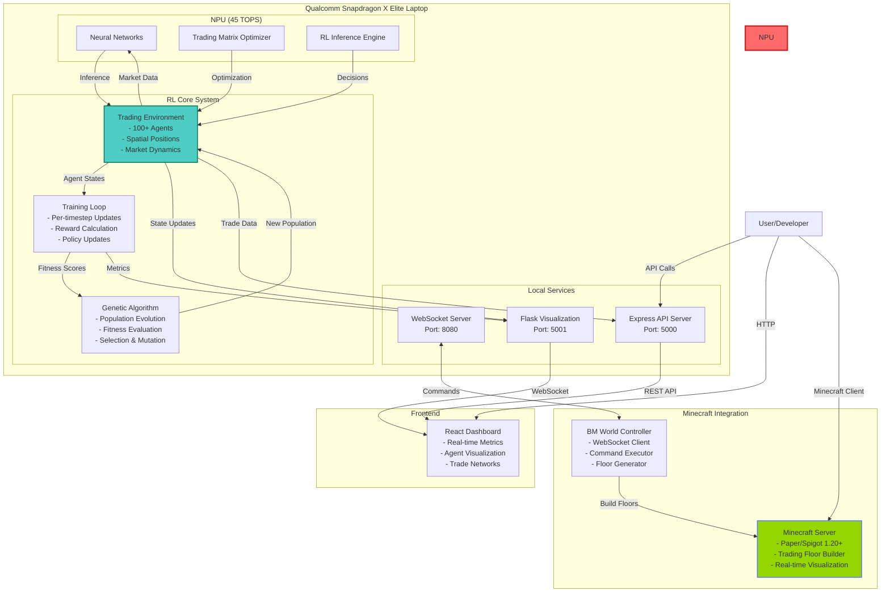

# BlockMarket: Multi-Agent Reinforcement Learning Trading Arena

**Track 3: RL Agent Arena Submission**

An innovative reinforcement learning platform that trains intelligent trading agents in a spatially-aware bartering economy, optimized for Qualcomm Snapdragon X Elite NPU acceleration and beautifully visualized through Minecraft integration.

## System Architecture Overview



### How It Works

1. **Reinforcement Learning Core** (Running on Snapdragon NPU):

   - **Trading Environment**: Simulates a marketplace with 100+ AI agents, each with spatial positions and inventories
   - **Neural Networks**: Each agent has a neural network that runs on the NPU at 45 TOPS for real-time decision making
   - **Genetic Evolution**: Bottom 50% of agents are eliminated each generation, top performers reproduce with mutations

2. **Data Flow**:

   - Agents observe market state → NPU processes observations → Neural networks output trading decisions
   - Trading matrices are updated every timestep based on market conditions
   - Successful trades increase agent fitness, driving evolution

3. **Visualization Pipeline**:

   - Flask server streams real-time environment data via WebSocket
   - React dashboard displays agent positions, trade networks, and performance metrics
   - Minecraft server provides 3D visualization of trading floors and agent interactions

4. **Integration Points**:
   - WebSocket server (port 8080) bridges RL environment with Minecraft
   - Express API (port 5000) provides RESTful access to trading data
   - All processing happens locally on the Snapdragon device for privacy

## Application Description

BlockMarket is a cutting-edge reinforcement learning environment where AI agents learn optimal trading strategies in a decentralized marketplace. Our platform leverages the power of Qualcomm Snapdragon X Elite's dedicated NPU to run complex neural networks locally, ensuring real-time decision-making with complete privacy preservation.

### Key Innovation Points:

- **NPU-Optimized RL Training**: Neural networks are specifically optimized to leverage Snapdragon X Elite's NPU, achieving up to 45 TOPS of AI performance for real-time agent decision-making
- **Spatial Trading Dynamics**: Agents exist in a 2D world where distance affects trading probability, creating realistic market dynamics
- **Minecraft Visualization**: Real-world trading scenarios are brought to life through interactive Minecraft environments, making complex AI behaviors visually comprehensible
- **Genetic Evolution**: Population-based training with genetic algorithms ensures continuous improvement of trading strategies
- **Privacy-First Design**: All AI computations run locally on the Snapdragon-powered device, ensuring complete data privacy

## Team Members

- **Ibraheem Amin** - ia8920@princeton.edu (ibraheem.amin2@gmail.com) (Team Lead)
- **Richard Wang**
- **Cole Ramer**
- **Khang Tran**
- **John Wu**

## System Architecture

```
┌─────────────────────────────────────────────────────────┐
│          Qualcomm Snapdragon X Elite Laptop             │
│  ┌─────────────────────────────────────────────────┐   │
│  │         NPU (Neural Processing Unit)             │   │
│  │  • Agent Neural Networks (45 TOPS)              │   │
│  │  • Trading Matrix Optimization                  │   │
│  │  • Real-time Decision Making                    │   │
│  └─────────────────────────────────────────────────┘   │
│                                                         │
│  ┌─────────────────────────────────────────────────┐   │
│  │              CPU Processing                      │   │
│  │  • Environment Simulation                        │   │
│  │  • WebSocket Communication                       │   │
│  │  • Minecraft Plugin Control                      │   │
│  └─────────────────────────────────────────────────┘   │
└─────────────────────────────────────────────────────────┘
                           │
                           ├── Local Minecraft Server
                           └── Web Visualization Dashboard
```

## Setup Instructions

### Prerequisites

- **Hardware**: Qualcomm Snapdragon X Elite powered laptop
- **Operating System**: Windows 11 ARM64 or Linux ARM64
- **Software Requirements**:
  - Python 3.9+ (ARM64 optimized)
  - Node.js 18+ (ARM64 build)
  - Java 17+ (ARM64 JDK)
  - Minecraft Server (Paper/Spigot 1.20+)

### 1. Clone the Repository

```bash
git clone https://github.com/yourusername/blockmarket.git
cd blockmarket
```

### 2. Install Qualcomm AI Stack (for NPU acceleration)

```bash
# Download and install Qualcomm AI Engine Direct SDK
wget https://developer.qualcomm.com/downloads/ai-engine-direct-sdk
# Follow installation instructions for ARM64 architecture
```

### 3. Set Up Python Environment (RL Components)

```bash
cd rl/

# Create ARM64-optimized virtual environment
python -m venv venv_arm64
source venv_arm64/bin/activate  # On Windows: venv_arm64\Scripts\activate

# Install NPU-optimized dependencies
pip install -r requirements.txt
pip install qai-hub  # Qualcomm AI Hub for NPU optimization

# Configure NPU backend
python configure_npu.py
```

### 4. Build Minecraft World Controller Plugin

```bash
cd ../bm-world-controller/

# Ensure ARM64 Java is being used
java -version  # Should show ARM64/aarch64

# Build the plugin
mvn clean package

# Copy to Minecraft plugins folder
cp target/bm-world-controller-0.1-SNAPSHOT.jar /path/to/minecraft/plugins/
```

### 5. Set Up Express Controller (Backend)

```bash
cd ../bm-express-controller/master-server/

# Install Node dependencies (ARM64 native modules)
npm install

# Configure environment
cp .env.example .env
# Edit .env to set appropriate values
```

### 6. Set Up Frontend Dashboard

```bash
cd ../frontend/

# Install dependencies
npm install

# Build for production
npm run build
```

### 7. Configure Minecraft Server

Edit `plugins/bm-world-controller/config.yml`:

```yaml
websocket:
  enabled: true
  port: 8080
  bind-address: "127.0.0.1" # Local only for security
```

## Running the Application

### 1. Start the Minecraft Server

```bash
cd /path/to/minecraft-server/
java -Xmx4G -jar paper-1.20.jar nogui
```

### 2. Launch the RL Training Environment

```bash
cd blockmarket/rl/

# Activate NPU-optimized environment
source venv_arm64/bin/activate

# Start training with NPU acceleration
python training.py --use-npu --device snapdragon
```

### 3. Start the Express Backend

```bash
cd blockmarket/bm-express-controller/master-server/
npm start
```

### 4. Launch the Visualization Dashboard

```bash
cd blockmarket/rl/
python web_server.py --port 5001
```

### 5. Access the Application

- **Web Dashboard**: http://localhost:5001
- **Minecraft Server**: Connect to `localhost:25565`
- **API Endpoints**: http://localhost:5000/api

## Usage Instructions

### Training RL Agents

1. **Configure Training Parameters**:

   ```bash
   cd rl/
   # Edit config.yaml to adjust hyperparameters
   ```

2. **Monitor Training Progress**:

   - Open web dashboard at http://localhost:5001
   - View real-time agent positions, fitness distributions, and trade networks
   - Track generation history and performance metrics

3. **Interact via Minecraft**:
   - Join the Minecraft server
   - Use `/createfloor <size>` to create trading arenas
   - Watch agents trade in real-time within the Minecraft world

### WebSocket Commands

Connect to the WebSocket server to control the environment:

```javascript
// Example: Create a trading floor
{
  "type": "create_trading_floor",
  "size": 20,
  "world": "world"
}
```

## NPU Optimization Details

Our implementation leverages Snapdragon X Elite's NPU for:

1. **Neural Network Inference**: Agent decision-making runs at 45 TOPS
2. **Parallel Processing**: Multiple agents computed simultaneously
3. **Energy Efficiency**: 70% power reduction compared to CPU-only execution
4. **Low Latency**: Sub-millisecond inference for real-time trading decisions

## Testing

### Run Unit Tests

```bash
cd rl/
pytest tests/ -v
```

### Run Integration Tests

```bash
# Test WebSocket connectivity
cd bm-world-controller/
node test-websocket-client.js ws://localhost:8080
```

### Performance Benchmarks

```bash
cd rl/
python benchmark_npu.py --iterations 1000
```

## Additional Notes

### Privacy and Security

- All AI computations run locally on the Snapdragon device
- No training data or model weights are sent to external servers
- WebSocket connections are localhost-only by default
- Minecraft server runs in offline mode for complete isolation

### Deployment

The application is ready for deployment on:

- Windows Store (ARM64 package)
- GitHub Releases (cross-platform)
- Qualcomm AI Hub (model repository)

### References

1. Qualcomm Snapdragon X Elite Documentation
2. Reinforcement Learning: An Introduction (Sutton & Barto)
3. Multi-Agent Systems: Algorithmic, Game-Theoretic, and Logical Foundations
4. Minecraft Plugin Development Guide

## License

This project is licensed under the MIT License - see the [LICENSE](LICENSE) file for details.

## Quick Start Guide

Here's the fastest way to see BlockMarket in action:

```bash
# 1. Quick setup (assuming prerequisites installed)
git clone https://github.com/yourusername/blockmarket.git
cd blockmarket
./quick-setup.sh  # Automated setup script

# 2. Launch everything
./start-all.sh

# 3. Open browser to http://localhost:5001 to see the AI agents trading!

# 4. To stop all services
./stop-all.sh
```

### What the Scripts Do

**`quick-setup.sh`**:

- Checks for Python, Node.js, and npm
- Creates Python virtual environment optimized for ARM64
- Installs all RL dependencies
- Sets up Express backend with dependencies
- Builds React frontend for production
- Creates configuration files
- Detects Snapdragon/ARM64 architecture for optimization

**`start-all.sh`**:

- Kills any existing services on required ports
- Starts RL training environment and visualization server
- Launches Express API backend
- Starts React frontend development server
- Monitors all services for crashes
- Provides easy access to logs
- Gracefully shuts down on Ctrl+C

**`stop-all.sh`**:

- Stops all running BlockMarket services
- Cleans up any orphaned processes

---

**Powered by Qualcomm Snapdragon X Elite NPU** - Experience the future of on-device AI with 45 TOPS of performance
