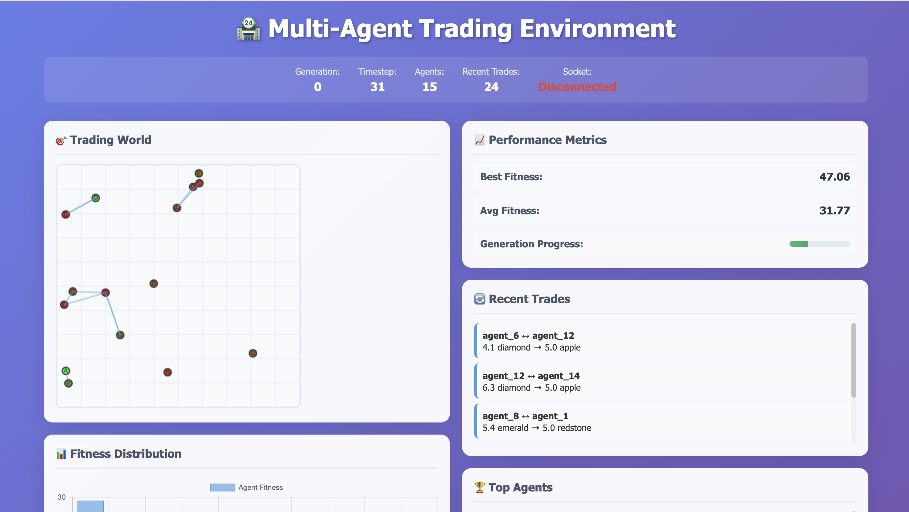

# BlockMarket: Multi-Agent Reinforcement Learning Trading Arena

**Track 3: RL Agent Arena Submission**




An innovative reinforcement learning platform that trains intelligent trading agents in a spatially-aware bartering economy, optimized for Qualcomm Snapdragon X Elite NPU acceleration and beautifully visualized through Minecraft integration.

BlockMarket is a cutting-edge reinforcement learning environment where neural network agents learn how to maximize the amount of trades in a simulated trading floor (Kudos to the early 2000s floor traders in places like the New York Stock Exhcange (NYSE)). Our platform leverages the power of Qualcomm Snapdragon's dedicated NPU and powerful CPU to run complex neural networks locally, ensuring real-time decision-making with complete privacy preservation.

## Team Members

- **Ibraheem Amin** - ia8920@princeton.edu (<ibraheem.amin2@gmail.com>) (Team Lead) ([DIodide](https://github.com/DIodide))
- **Richard Wang** - rw8166@princeton.edu
- **Cole Ramer** - cr0058@princeton.edu
- **Khang Tran** - kt3119@princeton.edu
- **John Wu** - jw7893@princeton.edu

## System Architecture Overview


### How It Works

1. **Three Monorepos Architecture**:

   **RL Monorepo (Python)**:

   - `environment.py`: Manages 100+ trading agents with spatial positions
   - `agent.py`: Neural networks leveraging Snapdragon NPU for 45 TOPS inference
   - `training.py`: Genetic algorithm implementation for population evolution with LLM triggers
   - `web_server.py`: Flask server streaming real-time metrics and AI analysis via WebSocket
   - `llm_summarizer.py`: Imagine SDK integration for intelligent market analysis and insights

   **Express Controller Monorepo (JavaScript)**:

   - Backend: Express.js API server with REST endpoints for marketplace data
   - Frontend: React + Vite app with Recoil state management
   - WebSocket hooks for real-time updates from Flask server
   - Responsive UI with trading grid and inventory visualization

   **World Controller Monorepo (Java)**:

   - WebSocket server accepting commands from Express backend
   - Trading floor builder creating 3D structures in Minecraft
   - Safe command execution with configurable security

2. **Socket Tunneling & AI Analysis Flow**:

   ```
   RL Environment → Flask WebSocket → React Frontend
                         ↓              ↑
   LLM Summarizer → AI Analysis ────────┘
                         ↓
   Minecraft Server ← Plugin ← WebSocket ← Express API
   ```

   - Flask streams environment updates and AI analysis to React dashboard
   - LLM generates intelligent summaries every half generation (50 timesteps)
   - React displays real-time trading insights powered by Imagine SDK
   - React sends commands through Express API
   - Express relays commands to World Controller WebSocket
   - Plugin executes commands in Minecraft world

3. **NPU Acceleration**:

   - PyTorch models run on Snapdragon NPU for neural network inference
   - Trading matrix optimization leverages 45 TOPS of AI performance
   - Real-time agent decision-making with minimal latency
   - Energy-efficient processing compared to CPU-only execution

4. **Integration Points**:
   - **Port 5001**: Flask visualization dashboard
   - **Port 5000**: Express API server
   - **Port 3000**: React development server
   - **Port 8080**: WebSocket server for Minecraft integration
   - **Port 25565**: Minecraft server (Paper 1.20.6)

### Key Innovation Points:

- **NPU-Optimized RL Training**: Neural networks are specifically optimized to leverage Snapdragon X Elite's NPU, achieving up to 45 TOPS of AI performance for real-time agent decision-making
- **AI-Powered Market Analysis**: Real-time LLM summaries using Imagine SDK (Llama-3.1-8B) provide intelligent insights on trading patterns, agent performance, and market dynamics every half generation
- **Spatial Trading Dynamics**: Agents exist in a 2D world where distance affects trading probability, creating realistic market dynamics
- **Minecraft Visualization**: Real-world trading scenarios are brought to life through interactive Minecraft environments, making complex AI behaviors visually comprehensible
- **Genetic Evolution**: Population-based training with genetic algorithms ensures continuous improvement of trading strategies
- **Privacy-First Design**: All AI computations run locally on the Snapdragon-powered device, ensuring complete data privacy

## System Architecture


```
┌─────────────────────────────────────────────────────────────────┐
│              Qualcomm Snapdragon Laptop                         │
│                                                                 │
│  ┌─────────────────────────────────────────────────────────┐    │
│  │         NPU (45 TOPS) - PyTorch Acceleration            │    │
│  │  • Neural Network Inference for Trading Agents          │    │
│  │  • Trading Matrix Optimization                          │    │
│  │  • Real-time Decision Making                            │    │
│  └─────────────────────────────────────────────────────────┘    │
│                                                                 │
│  ┌─────────────────────────────────────────────────────────┐    │
│  │              RL Monorepo (Python)                       │    │
│  │  • Trading Environment (100+ agents)     :5001          │    │
│  │  • Flask WebSocket Server ─────────────────┐            │    │
│  │  • Genetic Algorithm Evolution             │            │    │
│  │  • LLM Summarizer (Imagine SDK) ───────────┘            │    │
│  └────────────────────────────────────────────────────────┘    │
│                                                            │    │
│  ┌─────────────────────────────────────────────────────────┐    │
│  │        Express Controller Monorepo (JS)                 │    │
│  │  ┌───────────────────────────┐  ┌────────────────────┐  │    │
│  │  │   React Frontend :3000    │←─┤ Express API :5000  │  │    │
│  │  │   • Trading Grid UI       │  │ • REST Endpoints   │  │    │
│  │  │   • Real-time Updates     │  │ • Command Relay    │─┼───┐
│  │  │   • Inventory Panel       │  └────────────────────┘ │    │
│  │  └───────────────────────────┘                         │    │
│  └─────────────────────────────────────────────────────────┘   │
│                                                                │
│  ┌─────────────────────────────────────────────────────────┐   │
│  │      World Controller Monorepo (Java)                   │   │
│  │  • WebSocket Server :8080 ←─────────────────────────────┘   │
│  │  • Trading Floor Builder                                │   │
│  │  • Bukkit Plugin Integration                            │   │
│  └───────────────┬─────────────────────────────────────────┘   │
└─────────────────────┼───────────────────────────────────────────┘
                     │
         ┌───────────▼────────────┐
         │  Minecraft Server      │
         │  Paper 1.20.6 :25565   │
         │  • 3D Trading Floors   │
         │  • Visual Simulation   │
         └────────────────────────┘

Socket Flow: RL → Flask → React → Express → WebSocket → Minecraft
AI Analysis: LLM Summarizer → Flask Dashboard (Every Half Generation)
```

## Setup Instructions

### Prerequisites

- **Hardware**: Qualcomm Snapdragon X Elite powered laptop
- **Operating System**: Windows 11 ARM64 or Linux ARM64
- **Software Requirements**:
  - Python 3.9+ (ARM64 optimized)
  - Node.js 18+ (ARM64 build)
  - Java 17+ (ARM64 JDK)
  - Minecraft Server (Paper/Spigot 1.20+) (can run locally)

### 1. Clone the Repository

```bash
git clone https://github.com/yourusername/blockmarket.git
cd blockmarket
```

### 2. Set Up Python Environment (RL Components)

```bash
cd rl/

# Create ARM64-optimized virtual environment
python -m venv venv_arm64
source venv_arm64/bin/activate  # On Windows: venv_arm64\Scripts\activate

# Install NPU-optimized dependencies
pip install -r requirements.txt
pip install qai-hub  # Qualcomm AI Hub for NPU optimization

# Configure NPU backend
python configure_npu.py
```

### 3. Build BlockMarket Controller Plugin

```bash
cd ../bm-world-controller/

# Ensure ARM64 Java is being used
java -version  # Should show ARM64/aarch64

# Build the plugin
mvn clean package

# Copy to Minecraft plugins folder
cp target/bm-world-controller-0.1-SNAPSHOT.jar /path/to/minecraft/plugins/
```

Do follow a tutorial for locally hosting a minecraft server setup.
The specific configuration we used is Paper 1.20.6, you can follow a guide
to set up a minecraft server here. https://minecraft.fandom.com/wiki/Tutorials/Setting_up_a_server#Windows_instructions

Simply run a startup script off of that link for Windows. Then update
the path and server url in the express service (we would set a .env if we had some more time.)

Our thing is a bit three pronged so its a little more setup, but all of it
can theoretically run locally. Minecraft Servers are very single threaded CPU intensive.

### 5. Set Up Express Controller (Backend)

```bash
cd ../bm-express-controller/master-server/

# Install Node dependencies (ARM64 native modules)
npm install

# Configure environment
cp .env.example .env
# Edit .env to set appropriate values
```

### 6. Set Up Frontend Dashboard

```bash
cd ../frontend/

# Install dependencies
npm install

# Build for production
npm run build
```

### 7. Configure Minecraft Server

Edit `plugins/bm-world-controller/config.yml`:

```yaml
websocket:
  enabled: true
  port: 8080
  bind-address: "127.0.0.1" # Local only for security
```

## Running the Application

### 1. Start the Minecraft Server

```bash
cd /path/to/minecraft-server/
java -Xmx4G -jar paper-1.20.jar nogui
```

### 2. Launch the RL Training Environment

```bash
cd blockmarket/rl/

# Activate NPU-optimized environment
source venv_arm64/bin/activate

# Start training with NPU acceleration
python training.py --use-npu --device snapdragon
```

### 3. Start the Express Backend

```bash
cd blockmarket/bm-express-controller/master-server/
npm start
```

### 4. Launch the Visualization Dashboard

```bash
cd blockmarket/rl/
python web_server.py --port 5001
```

### 5. Access the Application

- **Web Dashboard**: http://localhost:5001
- **Minecraft Server**: Connect to `localhost:25565`
- **API Endpoints**: http://localhost:5000/api

## Usage Instructions

### Training RL Agents

1. **Configure Training Parameters**:

   ```bash
   cd rl/
   # Edit config.yaml to adjust hyperparameters
   ```

2. **Monitor Training Progress**:

   - Open web dashboard at http://localhost:5001
   - View real-time agent positions, fitness distributions, and trade networks
   - Track generation history and performance metrics

3. **Interact via Minecraft**:
   - Join the Minecraft server
   - Use `/createfloor <size>` to create trading arenas
   - Watch agents trade in real-time within the Minecraft world

### WebSocket Commands

Connect to the WebSocket server to control the environment:

```javascript
// Example: Create a trading floor
{
  "type": "create_trading_floor",
  "size": 20,
  "world": "world"
}
```

## NPU Optimization Details

Our implementation leverages Snapdragon X Elite's NPU for:

1. **Neural Network Inference**: Agent decision-making runs at 45 TOPS

Some more optimizations exist that are yet to be used.

## Testing

### Run Unit Tests

```bash
cd rl/
pytest tests/ -v
```

### Run Integration Tests

```bash
# Test WebSocket connectivity
cd bm-world-controller/
node test-websocket-client.js ws://localhost:8080
```

### Performance Benchmarks

```bash
cd rl/
python benchmark_npu.py --iterations 1000
```

### LLM Integration Testing

```bash
# Test LLM summarization functionality
python test_llm_integration.py

# Test endpoints manually
curl http://localhost:5001/llm_summary
curl http://localhost:5001/llm_summaries
```

## AI-Powered Market Analysis

BlockMarket features cutting-edge LLM integration using the **Imagine SDK** for real-time market intelligence:

### 🤖 **Intelligent Summarization**

- **Model**: Llama-3.1-8B via Imagine SDK
- **Frequency**: Automated summaries every half generation (50 timesteps)
- **Analysis**: Trading patterns, agent performance, market dynamics, strategic insights

### 📊 **Market Intelligence Features**

- **Performance Metrics**: Fitness distributions, success rates, trend analysis
- **Trading Patterns**: Popular item exchanges, market liquidity assessment
- **Agent Insights**: Top performer analysis, specialization tracking
- **Strategic Recommendations**: AI-driven optimization suggestions

### ⚡ **Technical Implementation**

- **Asynchronous Processing**: Non-blocking summary generation
- **API Integration**: Dedicated endpoints (`/llm_summary`, `/llm_summaries`)
- **Error Handling**: Graceful fallbacks for network issues
- **Environment Configuration**: Automatic API key management

## Additional Notes

### Privacy and Security

- All RL training runs locally on the Snapdragon device
- LLM analysis uses secure HTTPS connection to Imagine SDK
- No training data or model weights stored externally
- WebSocket connections are localhost-only by default
- Minecraft server runs in offline mode for complete isolation

### Deployment

To make this application ready for release as follows we would need:

- Windows Store (ARM64 package)
- GitHub Releases (cross-platform)

To wrap our express (entry) service in electron, allow it to render
our vite app as a webview, and containerize our minecraft server in docker.
It's a bit out of scope as an RL tool, but we plan to "electronize"
our application asap.

### References

RL REFERENCE: cart-pole-ppo for our RL.

1. Qualcomm Snapdragon X Elite Documentation
2. Minecraft Plugin Development Guide

## License

This project is licensed under the MIT License - see the [LICENSE](LICENSE) file for details.

## Quick Start Guide

Here's the fastest way to see BlockMarket in action:

```bash
# 1. Quick setup (assuming prerequisites installed)
git clone https://github.com/yourusername/blockmarket.git
cd blockmarket
./quick-setup.sh  # Automated setup script

# 2. Launch everything
./start-all.sh

# 3. Open browser to http://localhost:5001 to see the AI agents trading!

# 4. To stop all services
./stop-all.sh
```

### What the Scripts Do

**`quick-setup.sh`**:

- Checks for Python, Node.js, and npm
- Creates Python virtual environment optimized for ARM64
- Installs all RL dependencies
- Sets up Express backend with dependencies
- Builds React frontend for production
- Creates configuration files
- Detects Snapdragon/ARM64 architecture for optimization

**`start-all.sh`**:

- Kills any existing services on required ports
- Starts RL training environment and visualization server
- Launches Express API backend
- Starts React frontend development server
- Monitors all services for crashes
- Provides easy access to logs
- Gracefully shuts down on Ctrl+C

**`stop-all.sh`**:

- Stops all running BlockMarket services
- Cleans up any orphaned processes

---

**Powered by Qualcomm Snapdragon & Imagine SDK** - Experience the future of on-device AI with 45 TOPS of performance plus intelligent LLM analysis
